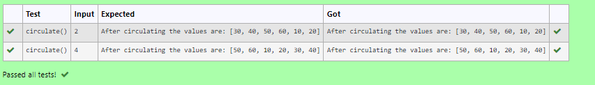

# Circulate-the-values-of-N-variables
## Aim:
To write a python program to circulate the n variables using function concept
## Equipment’s required:
PC
Anaconda - Python 3.7
## Algorithm: 

### Step 1: 
Start Program

### Step 2: 
import numpy

### Step 3: 
Get the value from the user for the number of rotation

### Step 4: 
Using the slicing concept rotate the list

### Step 5: 
print the result

### Step 6: 
End Program

## Program:
```
#Program to circulate N values.
#Developed by: Sarankumar J
#RegisterNumber:21500780
def circulate():
    l=[10,20,30,40,50,60]
    n=int(input ())
    r=l[n:]+l[:n]
    print("After circulating the values are:",r)

```

## Output:



## Result:
Successfully Finished
